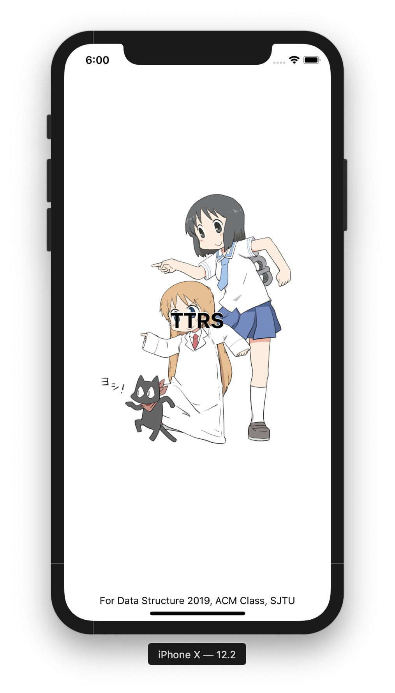
## TTRS - iOS用户手册 

[TOC]

### 安装

Please contact `oscardhc AT sjtu.edu.cn` !

### 登录和注册

#### 登录

初始进入时用户未登录，只能进行查询操作，不能进入「管理」和「我的」界面。当在tab bar中选中需要登录的界面时，会自动弹出登录窗口提示登录，请根据提示信息填入「用户ID」和「密码」，点击「确认」按钮以提交登录。

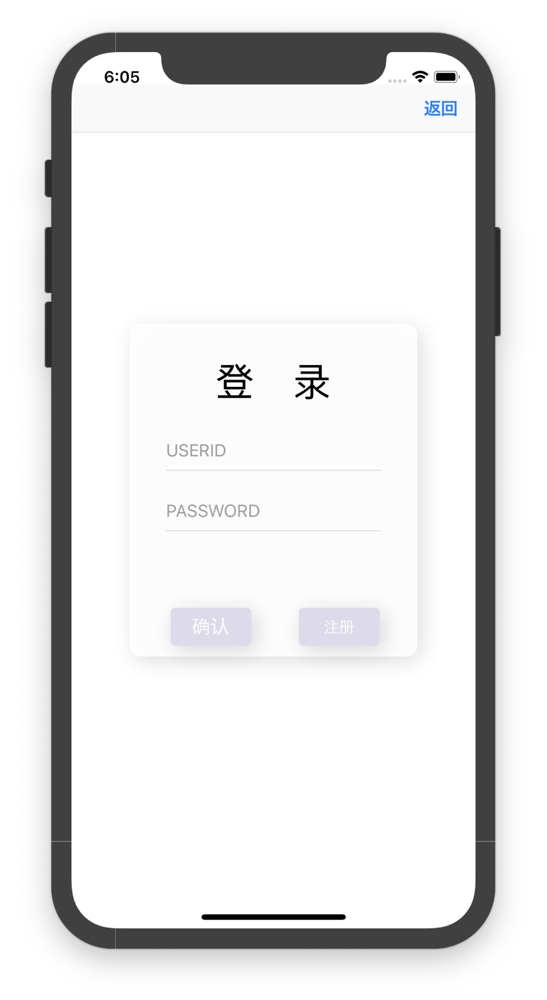

#### 注册

若您还未注册，可以通过点击登录界面中的「注册」按钮进入注册界面。请按照提示填写「昵称」、「密码」、「邮箱」和「电话」，并点击「确定」来提交注册信息。系统会通过弹窗方式反馈注册结果，并告知「用户ID」作为登录依据。

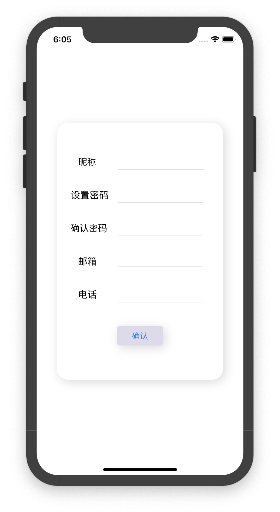

### 查询车票和购买

tab bar的第一个视图即为查询界面，查询者请按照提示输入欲查询的「出发站」、「到达站」以及「出发日期」。

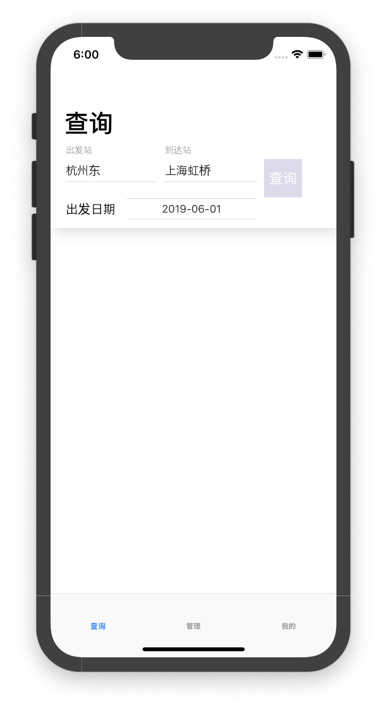

点击「查询」按钮提交查询后，所有符合条件的车次信息都将出现在，列表中。可以点击其中任意一个单元来查看该车票的详细信息。

在滑动视图中有该列车经过的所有车站信息，其下的小字表格中列有每一种票名及其余票数量。点击「购买」按钮可以进入购票确认界面。

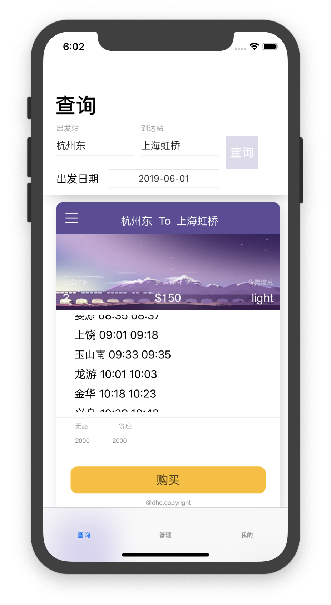

购票确认界面中有列车的基本信息，购买者请在下方「票名」、「余票数量」和「价格」的表格中点击需要的类型，背景变为淡紫色即已选择成功，可以点击「提交订单」来购买选中的车票。

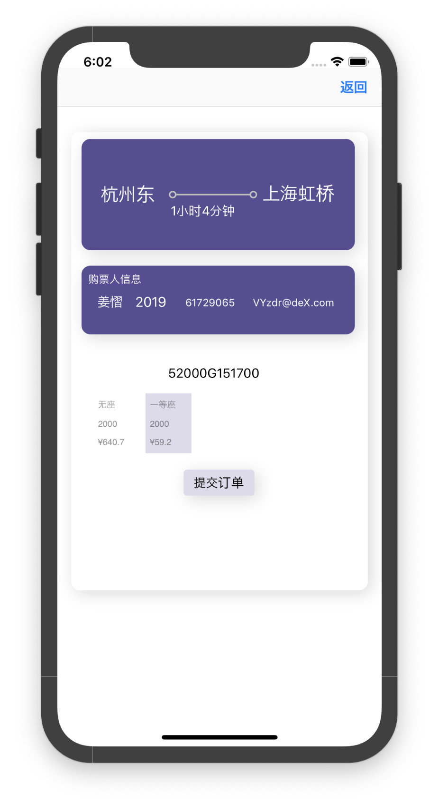

系统会根据您的购票信息和车次信息生成属于您的车票，至此购买过程已经完成。

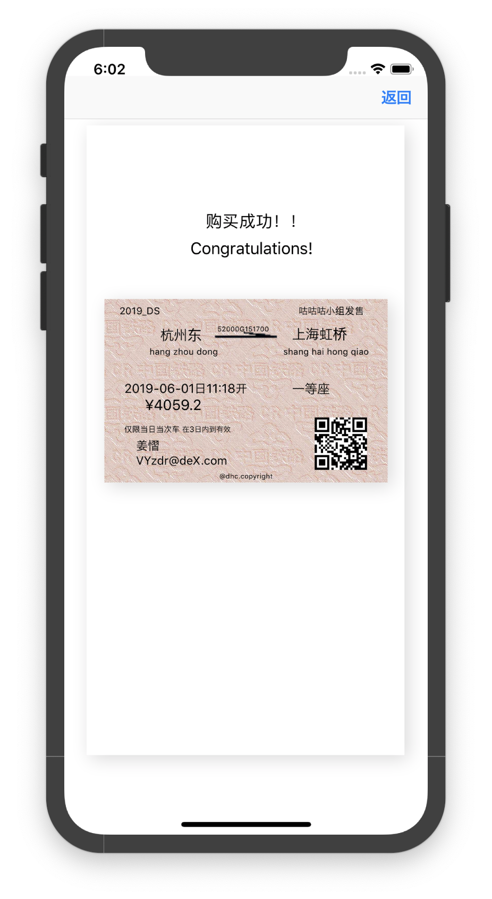

### 管理

如果您是管理员，您也可以在移动端进行部分管理操作，请点击tab bar中第二栏「管理」以进入管理页面。

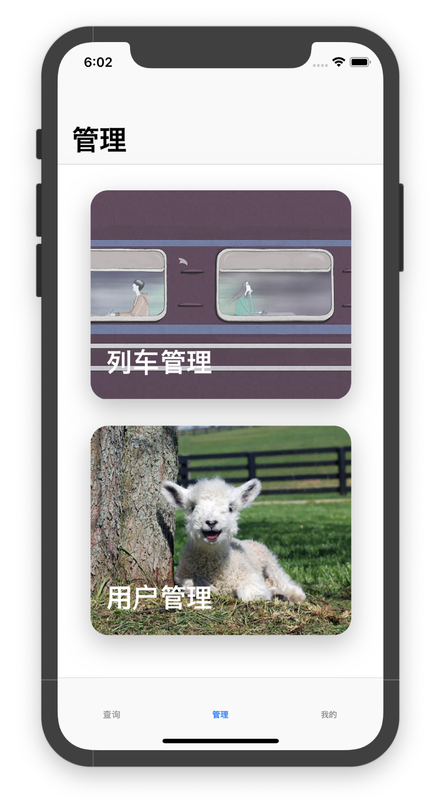

管理员可以查询车次的详细信息，请点击「列车管理」卡片，进入列车管理界面。根据提示输入「列车ID」并点击右侧「查询」按钮，该列车每一站的详细信息将会被呈现。

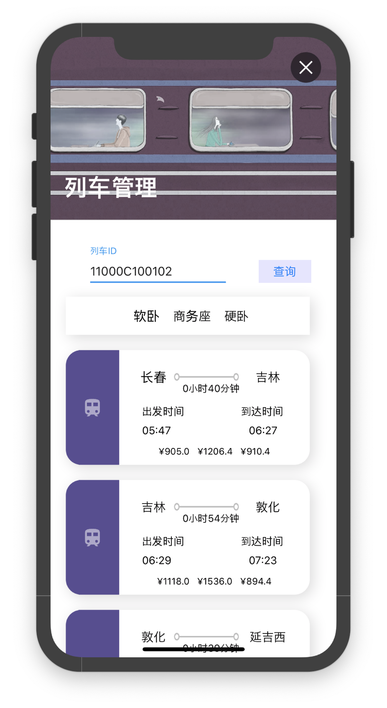

管理员也可以任意修改用户信息，请点击「用户管理」卡片进入用户管理界面。根据提示输入「用户ID」并点击「查询」按钮。此时该用户的个人信息将出现在下方的文本框中，你可以修改其中内容，点击最下方的「确认」按钮提交对用户信息的修改。系统将通过弹窗提示成功与否。

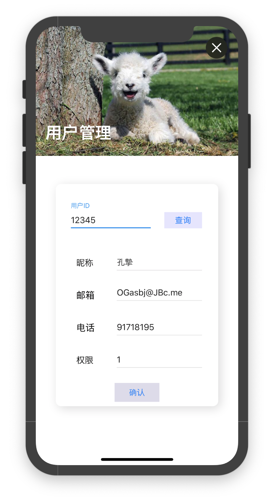

### 用户操作

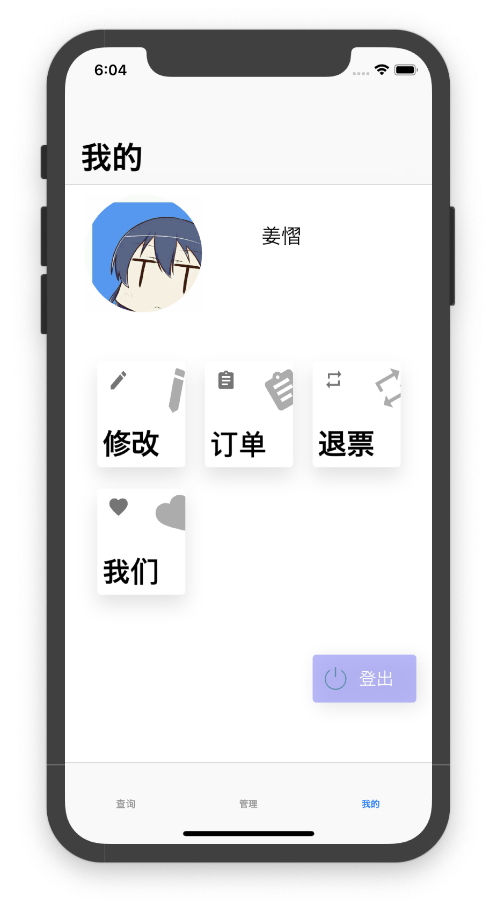

对于已登录的用户，您有权修改自己的个人信息，此时请点击tab bar的第三个视图「我的」，进入用户信息界面。在该界面中，您可以点击头像或是「修改」卡片进入修改个人信息页面，文本框中。

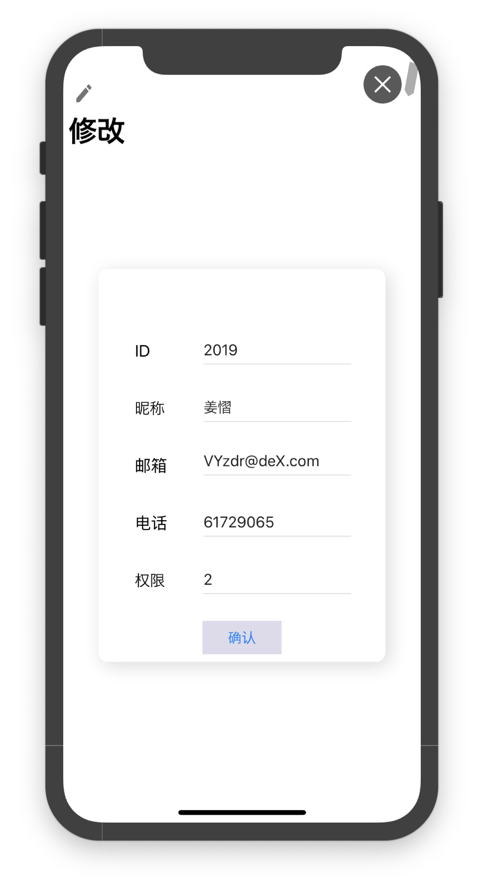

### 查询订单和退票

在「我的」视图中，您也可以查询自己的购票记录，请点击「订单」卡片进入订单管理界面。按照提示输入需要查询「日期」后，点击确定，即可查询到该日所有购票记录，以列表形式呈现。

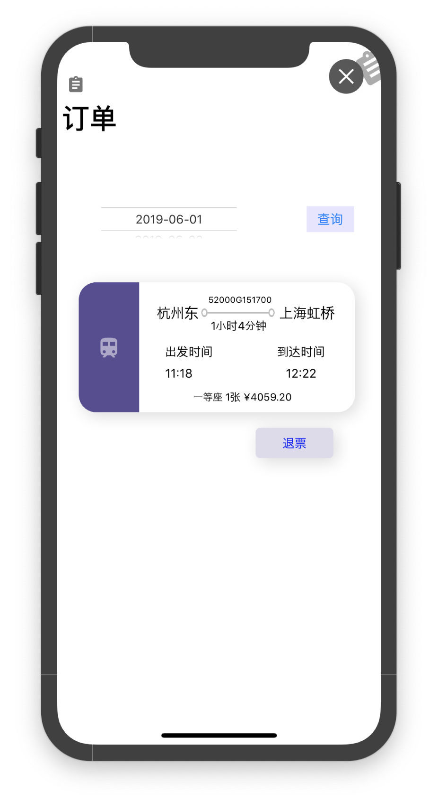

对于想要退票的订单，请点击其下的「退票」按钮进入退票页面，退票所需信息系统会自动填写，您只需点击「确认」按钮以提交退票操作。系统将通过弹窗提示成功与否。

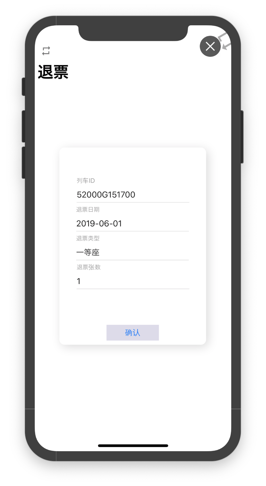

### 关于

您也可以点击「我们」卡片进入制作者界面，其中有关于制作人的信息，如果喜欢敬请打赏。

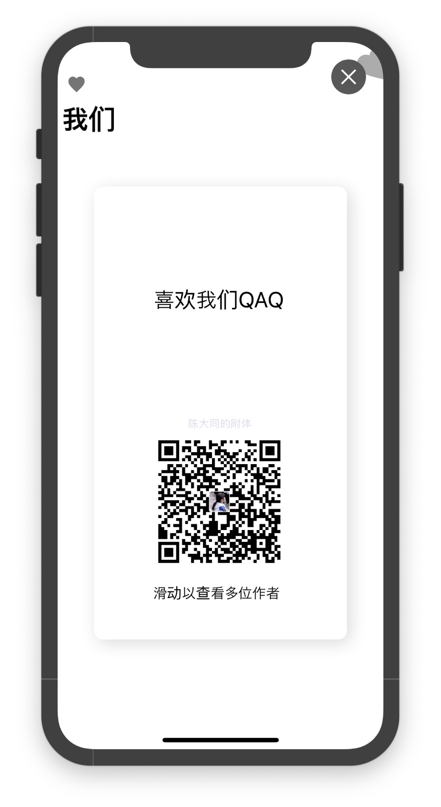