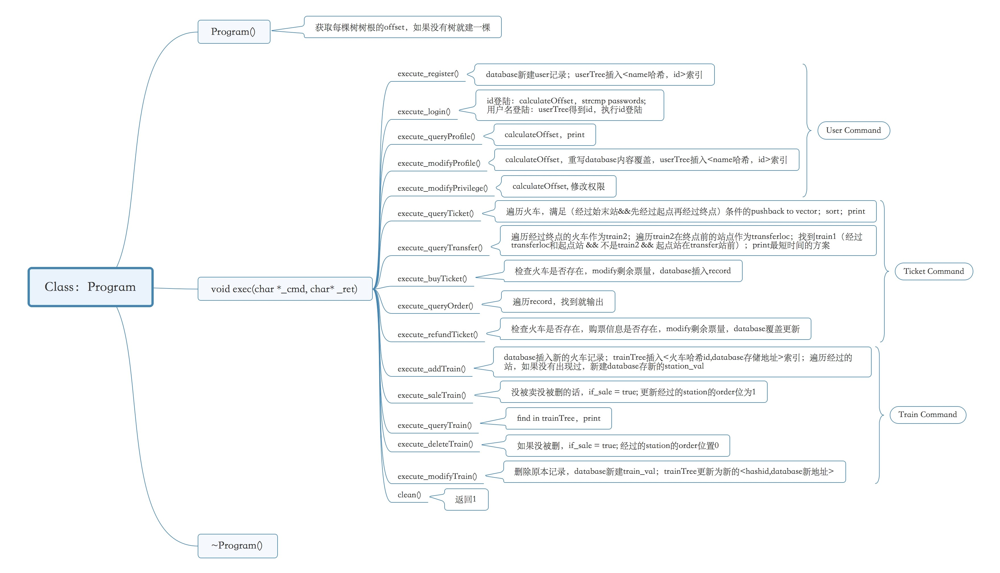
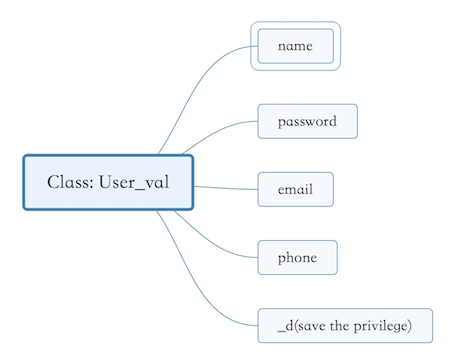
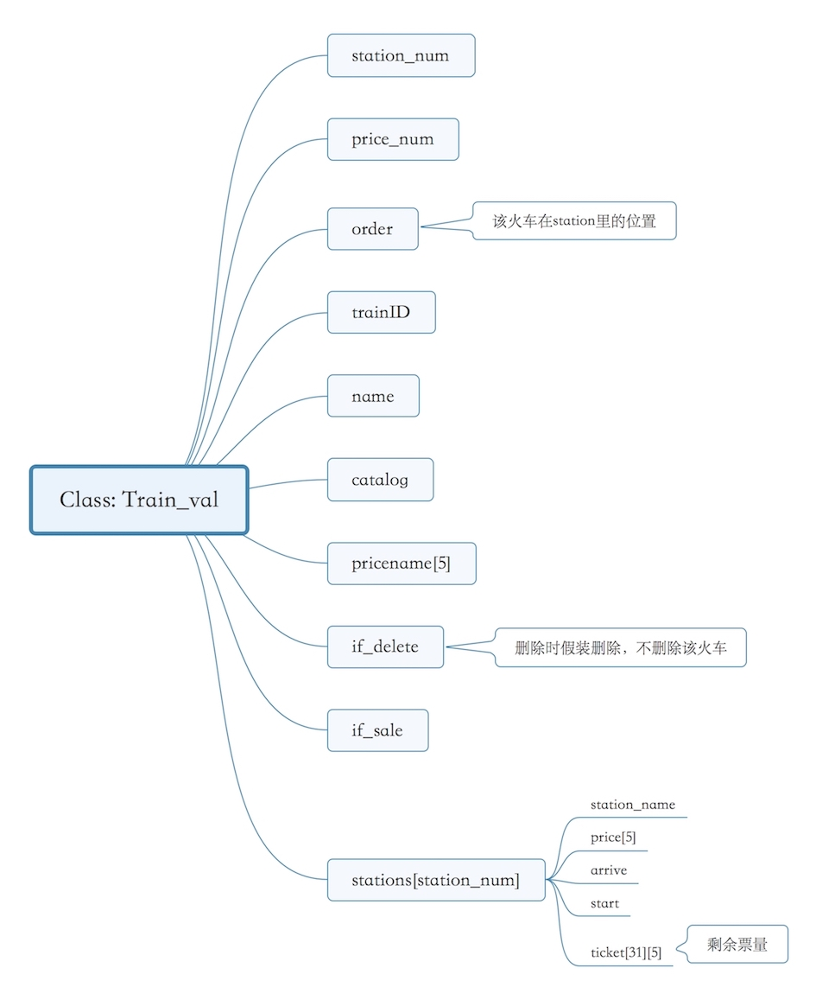
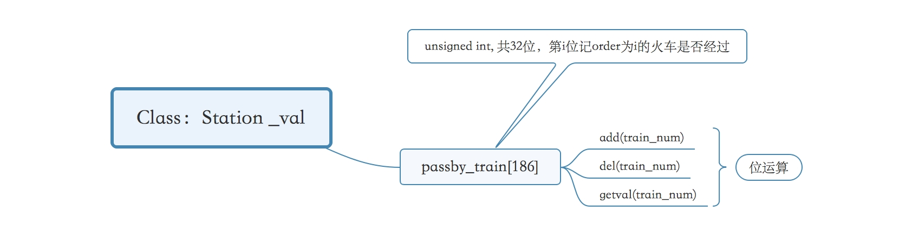
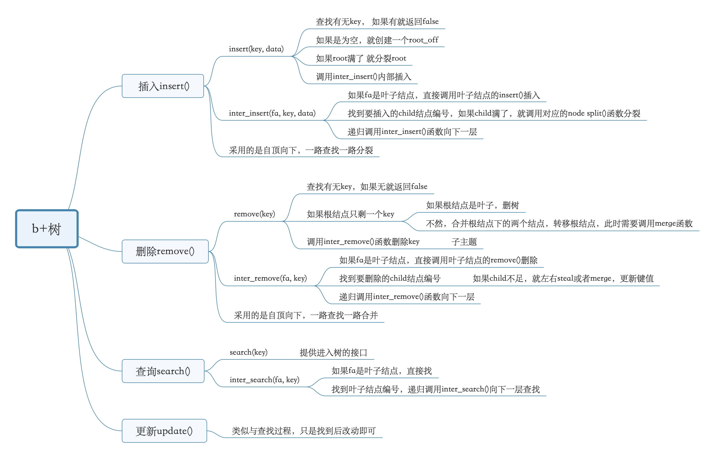
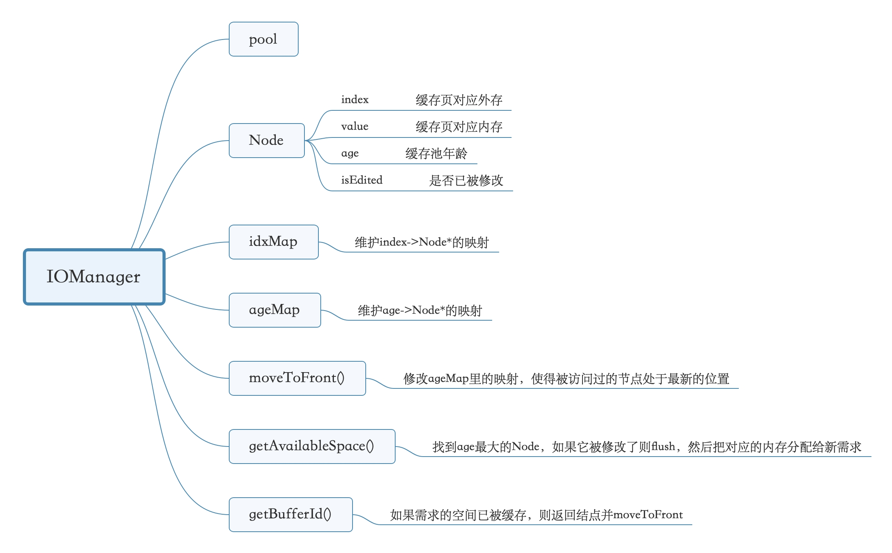
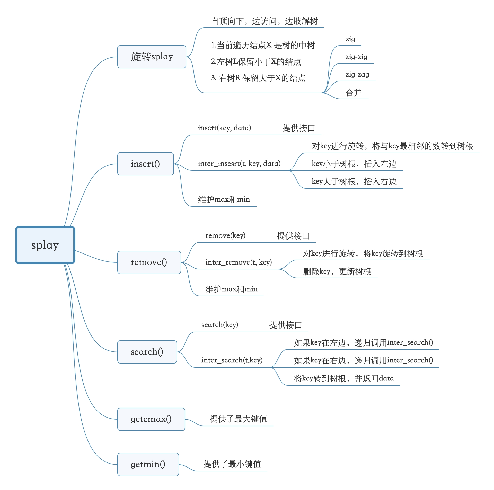

## TTRS - 后端开发文档

### 简介

开发环境：macOS 10.14 + CLion

测试环境：macOS 10.14 / Ubuntu 16.04

开发技术：c++

开发人员：傅凌玥，吴怀瑾，董海辰

### 整体架构

- 一个缓存池

- 六个文件
- 一个程序
- 三个成员
- 一个组长

### Class:Program

cmd接收读入的命令，ret返回命令结果，exec用于执行交互；

成员cnt_train为当前火车数量；

成员userCurId为当前成员id；

userTree存储<用户名哈希，ID>映射,ID->database映射可以用calculateOffset()计算；

trainTree存储<火车ID哈希，database里面的offset>映射；

stationTree存储<station名哈希，database里面的offset>映射；

### Class: User_val

用于存储用户信息，占有database中固定大小的一块空间。

### Class: Train_val

用于保存火车信息的类，大小可变。

### Class : Sation_val

用于保存站点信息，固定大小为186个32位数组，来保存每一辆火车是否经过的信息。

由于查找站点前一定已知站点名，故在站点中无需保存站点名称。

### Class: Record

用于保存记录信息，因为要合并同类id、比较catalog，故trainid和catalog独立保存，

### Class: bpTree

#### 基类：CNode

### Class ：IOManager

#### Class: Splay

IOManager的工具。

