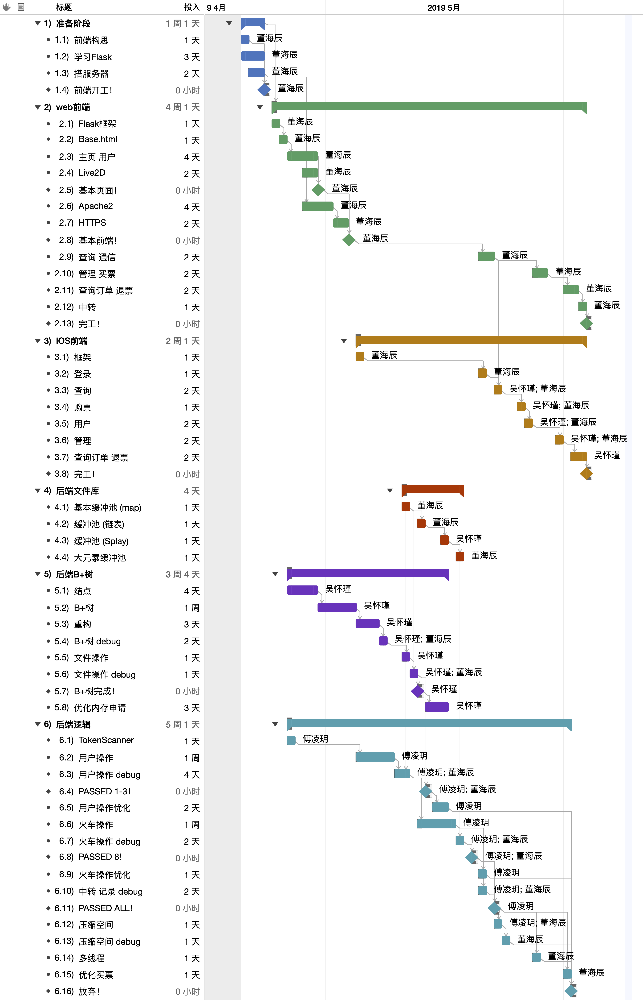
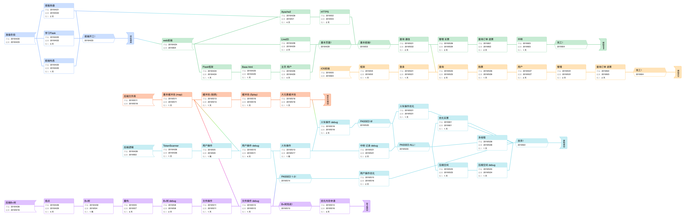

## TTRS - DS 2019

此乃上海交通大学ACM班「数据结构」课程作业，咕咕咕小组呕心沥血之作。

| 成员   | 主要分工                                           |
| ------ | -------------------------------------------------- |
| 董海辰 | 组长，web前端、iOS前端、前后端通信、后端文件管理。 |
| 吴怀瑾 | iOS前端、后端B+树及其他数据结构。                  |
| 傅凌玥 | 后端核心逻辑及实现，开发文档。                     |

